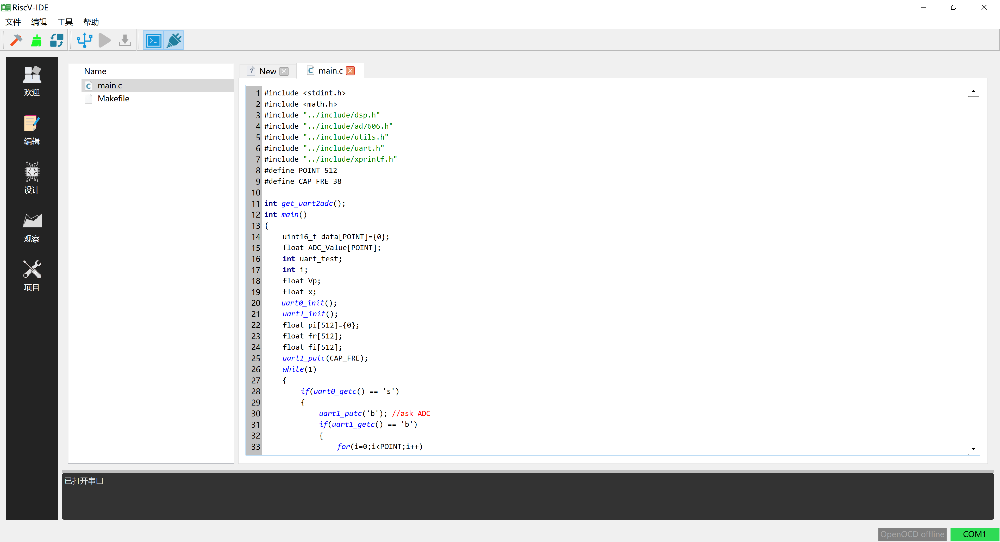
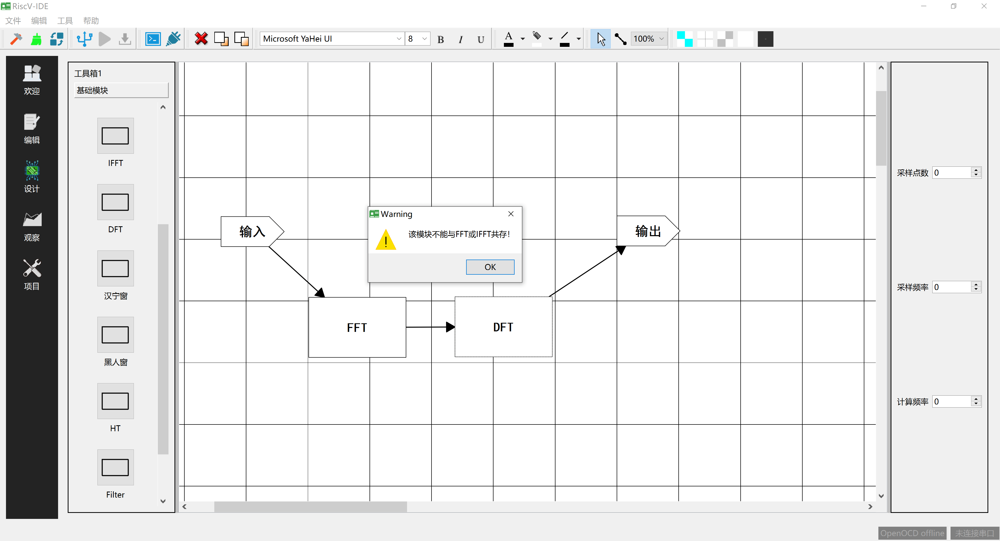
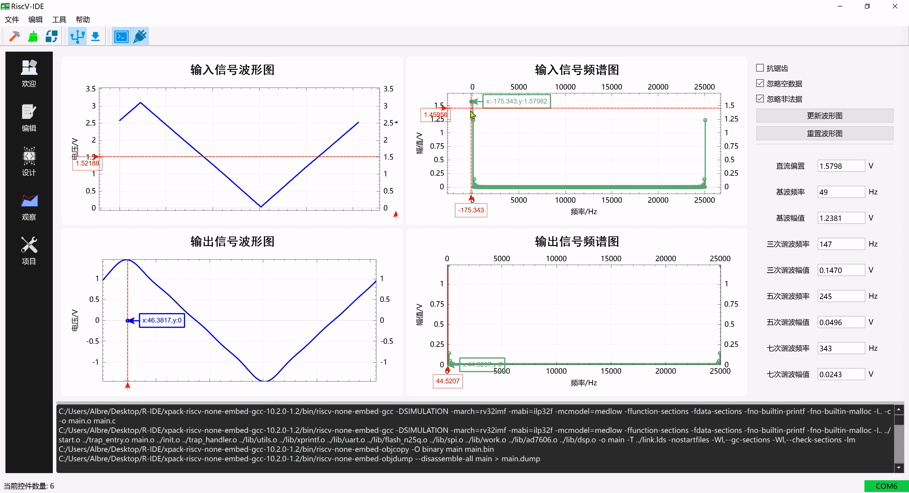

# Modular DA (Modular Designer & Analyzer)

## 1 简介

这是一个模块化设计分析器上位机软件（`Design`&`Analyze`），用于对基于`RISC-V`指令集架构的SoC配合使用，以进行信号分析工作。支持将分析算法抽象成图形化模块，通过对模块间的组合设计来自动生成程序代码，同时又集编译、烧录、串口通信、信号分析等功能于一身，通过简单的拖拽操作即可完成信号的设计与分析。

---

## 2 特色

 - 算法模块化、图形化
 - 拖拽式编程
 - 信号分析
 - 串口通信
 - 编译
 - 烧录
 - 调试

---

## 3 预览

### 3.1 代码编辑器

### 3.2 算法设计器

### 3.3 信号分析器

## 4 使用

### 4.1 环境配置

 - 在`工具-配置`中，依次选择：
   - `make`工具可执行文件路径
   - `riscv64-xxx-elf-gcc`编译工具链根目录
   - `OpenOCD` 调试器可执行文件路径
   - `OpenOCD` 调试器配置文件可执行文件路径

### 4.2 项目路径

 - 通过`打开文件或项目路径` 来初始化项目

## 5 感谢

本项目用到了以下开源项目：

 - [QCustomPlot](https://www.qcustomplot.com/)
 - [Qt](https://www.qt.io/)
 - [RISC-V](https://riscv.org/)
 - [OpenOCD](http://openocd.org/)
 - [make](https://www.gnu.org/software/make/)
